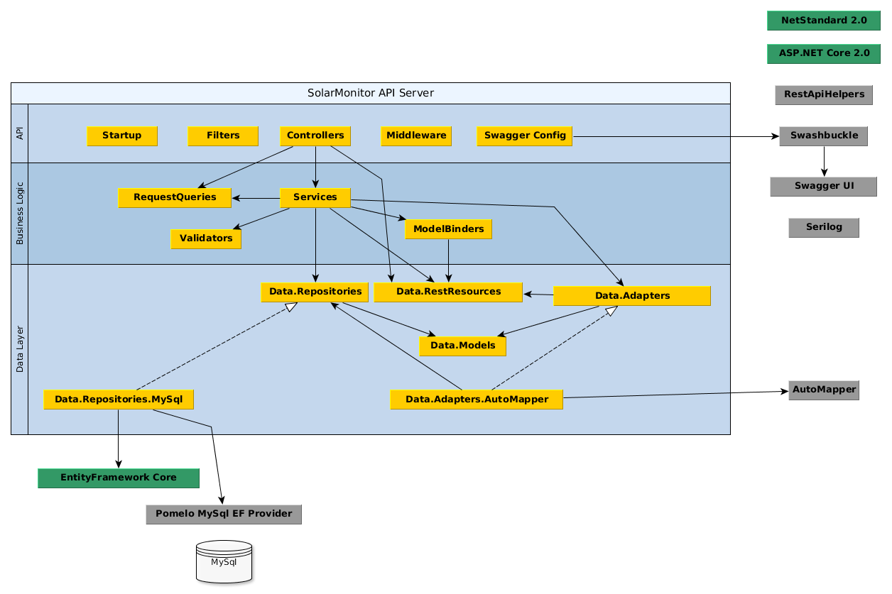

# SolarMonitorApi

<!-- TOC -->

- [SolarMonitorApi](#solarmonitorapi)
    - [Introduction](#introduction)
    - [How to build](#how-to-build)
        - [Prerequisites](#prerequisites)
        - [Build instructions](#build-instructions)
    - [Solar Monitor Project](#solar-monitor-project)
    - [Overall system](#overall-system)
    - [SolarMonitorApi Architecture](#solarmonitorapi-architecture)
    - [Authentication and authorization](#authentication-and-authorization)
    - [API Design](#api-design)
    - [Hosting](#hosting)
    - [Testing strategy](#testing-strategy)
        - [Unit tests](#unit-tests)
        - [Integration tests](#integration-tests)
        - [System (end-to-end) tests](#system-end-to-end-tests)

<!-- /TOC -->

## Introduction

The SolarMonitorApi application forms part of the [Solar Monitor Project](#solar-monitor-project).

The main purpose of the SolarMonitorApi is to persist solar measurements from various solar sites and to make this information available to different types of clients (web currently and mobile in the future) via a flexible RESTful API.

## How to build

### Prerequisites

- .NET Core 2.0 SDK
- MySQL server 5.7

Note: this project has been developed with VS Code. The solution may also work in Visual Studio 2017 Update 3 as long as .Net Core 2.0 SDK is installed.

### Build instructions

1. Restore dependencies: `dotnet restore` (in root folder)
2. Build: `dotnet build` (in root folder)
3. Run tests: `dotnet test` (in a folder containing a test project)

More detailed notes about the different developer tools and commands can be found [here](DEVEL.md).

## Solar Monitor Project

The Solar Monitor project came out of the need to monitor a real off-grid solar system.

The main requirements of the system were:

- allow remote monitoring
- monitor the state of the battery to ensure it does not drop below a certain safe level to maximise its lifespan
- monitor the power used by different home appliances and identify inefficient uses of power
- determine how much energy is produced and consumed each day
- provide historical information to gain an understanding of energy consumption patterns

Monitoring the state of charge of the battery was a critical requirement as the battery bank I have installed uses a Sealed Lead Acid (AGM) technology, which is very sensitive to deep discharges.

In order to suport remote monitoring (and given the patchy Internet at my location), the main part of the system (the SolarMonitorApi) was hosted in a cloud provider (Linode).

## Overall system

The diagram below shows an overview of the entire system:

There are 3 major components that form part of the system:

1. The SolarMonitorApi (part of this repository). This is an ASP.NET Core Web.Api-based application, hosted in the cloud, which allows remote web clients to pull data related to the various solar systems registered with it.

2. The SolarMonitorGateway application. This runs on the individual gateway machines that are installed locally next to the solar systems. Its purpose is to communicate with the individual solar devices and sensors in order to retrieve information from them and push this data to the SolarMonitorApi server. This application was written in Go.

3. SolarMonitorWebClient application. This is an SPA (ReactJS) that obtains data from the SolarMonitorApi and displays it to the user via a selection of graphs.

## SolarMonitorApi Architecture

The SolarMonitorApi application is structured as shown above in 3 layers:

1. **API Layer**

   This layer contains the main components that implement the APIs: Controllers, Middleware, Swagger related configuration classes, Filters, etc.

   There are 5 different controllers that form part of the SolarMonitor API:

   - SolarMonitor - provides general information such as server version.
   - Sites  - information about the various solar sites in the system
   - Devices - describes various solar devices (such as Inverters, Charge Controllers, Solar Arrays, etc.)
   - Sensors - information related to the sensors in the system (shunts, current sensors, temperature and humidity sensors, sensors that hold energy statistical information, battery state of charge, etc.)
   - Measurements - measurement data produced at regular intervals by the sensors.

2. **Business Logic Layer**

    Contains the Services as well as supporting classes (Model Binders, Validators, Request Query classes).

3. **Data Layer**

   This layer contains the projects related to data access: Repositories, Data Models, REST Resources (i.e. DTOs), Adapters (for converting between Models and REST Resources). It also contains a MySQL implementation of the Repositories, which uses Entity Framework and the Pomelo MySQL EF Adapter to connect to the MySQL database.

   The project uses code-first database design. Models that belong the same category of entities (e.g. sensors or devices) are structured hierarchically. We map these hierarchies using the "Table per Hierarchy" mechanism, since it is the only mechanism supported by EF Core (as of 2.0). This means that for example the whole set of sensor related classes will be mapped to a single "Sensors" table in the database, with a discriminator column (SensorType) used by EF Core to automatically map the rows in the table to the correct Sensor-derived class.

## Authentication and authorization

This application uses self-contained JWT tokens for API authorization. SolarMonitorApi does not issue tokens directly but it relies on another service (see the AuthService repo) to perform the actual authentication and to issue tokens. The AuthService is based on IdentityServer4 and supports standard Open Connect and OAuth2 protocols.

There are 2 levels of access based on roles:

- 'user' role has access to all read-only APIs
- 'admin' role has access to all (read and write) APIs

## API Design

TBD

## Hosting

Hosting is done in Linode (Linux-based cloud provider) via a shared VM. I highly recommend this service - it costs USD5 a month for a very reliable and fast (shared) VM.

Initially I hosted the SolarMonitorApi via an Azure Web App service. This had the advantage that it was very easy to set up and required no maintenance. However the cost was too high for what I needed. Given that the application cross-platform (being based on .Net Core), I went for Linode.

## Testing strategy

The application contains tests at 3 levels, using xunit as the test harness:

### Unit tests

These are class level tests. Mock classes may be used to stub out external dependencies - this is trivial as almost all classes in the system use dependency injection for their dependencies.

### Integration tests

The integration tests form the bulk of the tests in the system. They are responsible for testing all APIs in a manner that very closely reflects the way the system is run in production, with 2 exceptions:

- the tests run the full SolarMonitorApi application in-process, however the full ASP.NET pipeline is loaded and executed for every request. The tests use the standard HttpClient class to send request to the server, even though it runs in the same process. This is achieved using the test infrastructure provided by ASP.NET Core called TestHost.

- the back-end MySQL database is substituted with an in-memory SQLite provider.

Each test is responsible for creating the database and populating it with the data that it needs and destroying it at the end. This means that tests are fully independent of each other and can be parallelised easily to make use of multiple cores.

The benefits of this approach is that the tests run very fast (under 1s per test including database set up and tear down) providing quick feedback on regressions while still exercising the full application stack.

### System (end-to-end) tests

The system tests are true end to end tests where the system is set up identically to the production environment:

- the SolarMonitorApi is hosted independently of the tests (in a Docker container)
- an actual MySQL database is used
- the external AuthService is also used for authentication and issuing tokens

This set of tests is fairly small. They are intended for validating the deployment procedure and to ensure everything is set up correctly while at the same time running some basic smoke tests to give enough confidence that everything is working as it should before pushing to production.